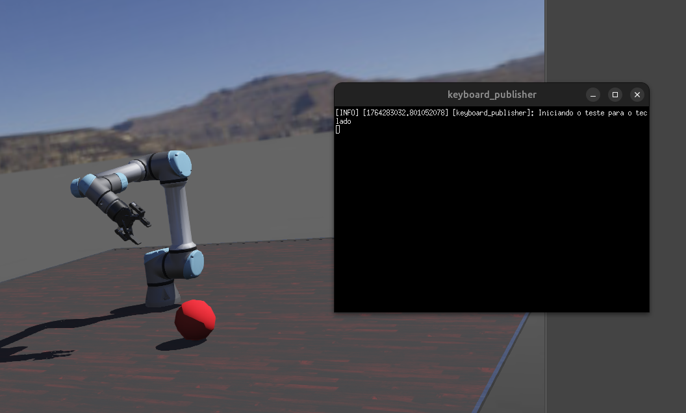

# Projeto Trainee: Simulação de Braço Robótico (ROS2/Webots)

Este repositório contém o ambiente de desenvolvimento containerizado **(Docker)** para o projeto de simulação de braço robótico com detecção de objeto utilizando **ROS2** e **Webots**.



O ambiente é baseado em **ROS2 Humble** e inclui o simulador **Webots (R2025a)**, **OpenCV**, e **NumPy**, todos pré-configurados para funcionar em conjunto[cite: 10, 11].

---
## ⚙️ Funcionamento
Adotamos uma arquitetura de Visual Servoing Baseado em Imagem **(IBVS - Image-Based Visual Servoing)** com uma abordagem heurística direta.<br>
(_"Servoing"_ refere-se à técnica de controle de movimento de um robô usando feedback visual extraído de uma câmera.)

**1. Eliminamos a Cinemática Inversa (IK)**: 
Na robótica clássica, o fluxo seria:
Detectar objeto em pixels `(u, v)`; converter pixels para coordenadas 3D no mundo `(x, y, z)` usando a matriz intrínseca da câmera e profundidade; calcular a Cinemática Inversa para descobrir quais ângulos de junta `(θ1, θ2, ...)` levam o efetuador até `(x, y, z)`; mover para esses ângulos.<br>
<br>
Nós sabemos que se o objeto está à esquerda na imagem, precisamos girar a Base para a esquerda. Sabemos que se o objeto está em cima na imagem, precisamos levantar o Ombro. Assim, mapeamos o **Erro em Pixels** diretamente para **Velocidade da Junta**, sem passar pela matemática complexa de coordenadas cartesianas 3D.
<br>

**2. Utilizamos um Controlador Proporcional (P-Controller)**:
<br>
A lógica matemática se resume a: `Velocidade = Ganho x Erro`
- **Erro (e)**: Ele calcula a diferença entre onde o objeto está `(x, y)` e o centro da imagem (320, 240).
- **Lei de Controle**: _`Vjunta = Kp x e`_ 
Se o objeto está à direita (erro positivo), movemos a junta positivamente.
Se o erro é zero (centralizado), a velocidade é zero.
- **Loop Principal**: A cada passo da simulação (step), lemos os bytes da câmera e empacotamos numa mensagem ROS padrão (bgra8 é o padrão do Webots, o cv_bridge no outro nó fará a conversão automática).

Dessa forma o **nó de controle** tem duas responsabilidades:
<br>
**Output (Atuadores)**: Receber comandos e mover juntas (já implementado).<br>
**Input (Sensores)**: Ler a câmera do Webots e publicar a imagem bruta para o ROS.
<br>

Não precisamos de integrais ou derivadas porque o loop de controle roda muito rápido (32ms a 60ms). O robô faz correções minúsculas e contínuas. Se ele não chegar lá na primeira tentativa, o loop roda de novo e ele corrige mais um pouco. Isso remove a necessidade de planejamento de trajetória complexo (Splines, Curvas de Bezier).<br>

Simplificamos o problema de um sistema **MIMO (Múltiplas Entradas, Múltiplas Saídas)** para dois sistemas simples **SISO (Entrada Única e Saída Única)**, onde o erro em X controla apenas a Junta 0 e o erro em Y controla apenas a Junta 1.<br>
Se fossemos usar a Matriz Jacobiana de Imagem (a forma tradicional), o código teria que calcular matrizes 2x6, inverte-las e fazer multiplicação matricial a cada frame. Nossa abordagem heurística funciona perfeitamente para centralizar objetos sem essa sobrecarga computacional. A lógica diminuiu porque trocamos um **cálculo geométrico explícito** (pesado e extenso) por **controle reativo em malha fechada** (leve e iterativo). O robô não "sabe" onde o objeto está no espaço 3D, ele apenas sabe que precisa reduzir o erro na imagem para zero.

---

## 📋 Pré-requisitos (Dependências do Host)

Antes de começar, certifique-se de que sua máquina (host) possui os seguintes softwares:

* **Git:** Para clonar o repositório.
* **Docker Engine:** Para construir e executar o contêiner.
* **(Opcional, mas Recomendado) NVIDIA GPU:**
    * Drivers da NVIDIA instalados.
    * [NVIDIA Container Toolkit](https://docs.nvidia.com/datacenter/cloud-native/container-toolkit/latest/install-guide.html) (para permitir que o Docker use a GPU, essencial para performance em simulação 3D).

> **Nota para Usuários Windows/macOS:**
> * **Windows:** Este setup é otimizado para **WSL2** (Windows Subsystem for Linux). Você precisará do [Docker Desktop com integração WSL2](https://docs.docker.com/desktop/install/windows-install/) e um X-Server como [VcXsrv](https://sourceforge.net/projects/vcxsrv/) para a interface gráfica.
> * **macOS:** Você precisará de um X-Server como [XQuartz](https://www.xquartz.org/).

---

## 🚀 Guia de Setup (Primeira Vez)

Siga estes passos **exatamente** para configurar o ambiente pela primeira vez.

### Passo 1: Clone o Repositório

```bash
git clone <url-do-seu-repositorio-github>
cd <nome-do-repositorio>
````

### Passo 2: Baixe o Instalador do Webots

Nosso `Dockerfile` foi feito para copiar o instalador do Webots localmente, evitando falhas de download durante o build.

Execute o comando a seguir no seu terminal (na pasta raiz do projeto) para baixar a versão exata necessária.

``` Bash
wget https://github.com/cyberbotics/webots/releases/download/R2025a/webots-R2025a-x86-64.tar.bz2
```

Isso garante que o arquivo `webots-R2025a-x86-64.tar.bz2` seja salvo na mesma pasta que o `Dockerfile`, pronto para a construção da imagem.
### Passo 3: Crie a Estrutura do Workspace

O ROS2 precisa de uma estrutura de pastas mínima para a primeira compilação.

``` Bash
# Cria as pastas necessárias para o 'trainee_ws'
mkdir -p workspace/trainee_ws/src
```

### Passo 4: Construa a Imagem Docker

Isso pode levar de 15 a 30 minutos na primeira vez, pois irá instalar o ROS2, Webots e todas as dependências2.

``` Bash
# O nome 'edrom_image' é o mesmo usado no script start_container.sh
docker build -t edrom_image .
```

> Nota: Caso não tenha o Docker instalado, siga o passo a passo presente em requirements_steps.md
### Passo 5: Inicie o Contêiner e Compile

Agora vamos iniciar o contêiner e compilar o workspace vazio.

1. **Inicie o contêiner:**  
``` Bash
./start_container.sh
```
    
> Nota: Na primeira vez, você verá um erro `bash: /trainee/workspace/trainee_ws/install/setup.bash: No such file or directory`. Isso é **normal**.
    
2. Dentro do contêiner, compile o workspace:
    
    Você estará no prompt ros@nitro:/trainee$.
    
``` Bash
cd /trainee/workspace/trainee_ws
colcon build
```

### Passo 6: Teste o Setup

Após a compilação, saia (`exit`) e entre novamente.

1. **Saia do contêiner:**
``` Bash
exit
```

1. **Inicie novamente:**
``` Bash
./start_container.sh
```
    
    Desta vez, **nenhum erro deve aparecer**. O prompt `ros@nitro:/trainee$` deve carregar limpo3.

O ambiente está pronto!

---

## 💻 Fluxo de Trabalho Diário

1. Iniciar o Ambiente:
    
    Abra um terminal na pasta do projeto e execute: 
``` Bash
./start_container.sh
```
    
2. **Desenvolver:**
    
    - Seu prompt é `ros@nitro:/trainee$`.
        
    - Seu workspace ROS2 está em `/trainee/workspace/trainee_ws`.
        
    - **IMPORTANTE:** Todo o código (pacotes ROS2, etc.) deve ser colocado dentro da pasta `/trainee/workspace/trainee_ws/src`.
        
    - Como a pasta do projeto está montada (`-v`), você pode usar sua IDE favorita (VS Code, PyCharm, etc.) no seu computador (host) para editar os arquivos.
        
3. Compilar (Dentro do Contêiner):
    
    Após adicionar ou modificar pacotes, compile:
``` Bash
cd /trainee/workspace/trainee_ws
colcon build
```
    
4. Parar o Ambiente:
    
    Simplesmente digite exit no terminal do contêiner.
    

---

## ✅ Validando o Ambiente

Execute estes comandos _dentro_ do contêiner para garantir que tudo está funcionando:

- **Testar Interface Gráfica (GUI):**  
``` Bash
rqt
```
    
    _(Uma janela deve abrir. Se falhar, veja o Troubleshooting.)_
    
- **Testar Versão do Webots:**
``` Bash
webots --version
```
    
    _(Deve retornar `Webots R2025a`)_

- **Teste de Integração (Webots + ROS2):**
``` Bash
ros2 launch webots_ros2_universal_robot robot_world_launch.py
```
    
    _(Isso deve abrir o simulador Webots com um robô UR5e.)_
    

---

## 📁 Estrutura do Projeto

```
.
├── Dockerfile              # Define nossa imagem Docker personalizada 
├── README.md               # Este arquivo
├── bashrc                  # Configurações do shell (prompt, aliases) dentro do contêiner 
├── entrypoint.sh           # Script de entrada do Docker
├── start_container.sh      # Script para INICIAR o contêiner
├── webots-R2025a-x86-64.tar.bz2  # Instalador do Webots (Requerido pelo Dockerfile)
└── workspace/
    └── trainee_ws/
        ├── build/          # (Gerado pelo colcon)
        ├── install/        # (Gerado pelo colcon)
        ├── log/            # (Gerado pelo colcon)
        └── src/            # <-- COLOQUE TODO O CÓDIGO ROS2 AQUI
```

---

## 💡 Boas Práticas (Git)

Recomendo fortemente adicionar um arquivo `.gitignore` para manter o repositório limpo.

Crie um arquivo chamado `.gitignore` na raiz do projeto com o seguinte conteúdo:


```
# Arquivos de compilação do ROS2
workspace/trainee_ws/build/
workspace/trainee_ws/install/
workspace/trainee_ws/log/

# Instalador do Webots (arquivo grande)
webots-R2025a-x86-64.tar.bz2

# Arquivos de IDE
.vscode/
.idea/
```

---

## ❓ Troubleshooting

**Erro: `bash: /trainee/workspace/trainee_ws/install/setup.bash: No such file or directory`**

- **Causa:** O workspace ainda não foi compilado.
    
- **Solução:** Entre no contêiner e execute `cd /trainee/workspace/trainee_ws && colcon build`.
    

**Erro: `cannot open display` (ou falha ao abrir `rqt` / `webots`)**

- **Causa:** O contêiner não consegue se conectar ao seu "display" (servidor gráfico).
    
- **Solução (Linux):** Feche o contêiner, execute `xhost +local:docker` no seu terminal **host** e tente rodar `./start_container.sh` novamente.
