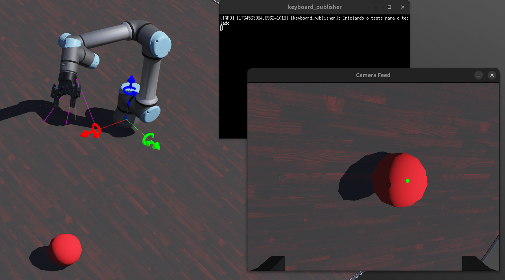

# Projeto Trainee: Simulação de Braço Robótico (ROS2/Webots)

Este repositório contém o ambiente de desenvolvimento containerizado **(Docker)** para o projeto de simulação de braço robótico com detecção de objeto utilizando **ROS2** e **Webots**.



O ambiente é baseado em **ROS2 Humble** e inclui o simulador **Webots (R2025a)**, **OpenCV**, e **NumPy**, todos pré-configurados para funcionar em conjunto[cite: 10, 11].


---

## 📋 Pré-requisitos (Dependências do Host)

Antes de começar, certifique-se de que sua máquina (host) possui os seguintes softwares:

* **Git:** Para clonar o repositório.
* **Docker Engine:** Para construir e executar o contêiner.
* **(Opcional, mas Recomendado) NVIDIA GPU:**
    * Drivers da NVIDIA instalados.
    * [NVIDIA Container Toolkit](https://docs.nvidia.com/datacenter/cloud-native/container-toolkit/latest/install-guide.html) (para permitir que o Docker use a GPU, essencial para performance em simulação 3D).

> **Nota para Usuários Windows/macOS:**
> * **Windows:** Este setup é otimizado para **WSL2** (Windows Subsystem for Linux). Você precisará do [Docker Desktop com integração WSL2](https://docs.docker.com/desktop/install/windows-install/) e um X-Server como [VcXsrv](https://sourceforge.net/projects/vcxsrv/) para a interface gráfica.
> * **macOS:** Você precisará de um X-Server como [XQuartz](https://www.xquartz.org/).

---

## 🚀 Guia de Setup (Primeira Vez)

Siga estes passos **exatamente** para configurar o ambiente pela primeira vez.

### Passo 1: Clone o Repositório

```bash
git clone <url-do-seu-repositorio-github>
cd <nome-do-repositorio>
````

### Passo 2: Baixe o Instalador do Webots

Nosso `Dockerfile` foi feito para copiar o instalador do Webots localmente, evitando falhas de download durante o build.

Execute o comando a seguir no seu terminal (na pasta raiz do projeto) para baixar a versão exata necessária.

``` Bash
wget https://github.com/cyberbotics/webots/releases/download/R2025a/webots-R2025a-x86-64.tar.bz2
```

Isso garante que o arquivo `webots-R2025a-x86-64.tar.bz2` seja salvo na mesma pasta que o `Dockerfile`, pronto para a construção da imagem.
### Passo 3: Crie a Estrutura do Workspace

O ROS2 precisa de uma estrutura de pastas mínima para a primeira compilação.

``` Bash
# Cria as pastas necessárias para o 'trainee_ws'
mkdir -p workspace/trainee_ws/src
```

### Passo 4: Construa a Imagem Docker

Isso pode levar de 15 a 30 minutos na primeira vez, pois irá instalar o ROS2, Webots e todas as dependências2.

``` Bash
# O nome 'edrom_image' é o mesmo usado no script start_container.sh
docker build -t edrom_image .
```

> Nota: Caso não tenha o Docker instalado, siga o passo a passo presente em requirements_steps.md
### Passo 5: Inicie o Contêiner e Compile

Agora vamos iniciar o contêiner e compilar o workspace vazio.

1. **Inicie o contêiner:**  
``` Bash
./start_container.sh
```
    
> Nota: Na primeira vez, você verá um erro `bash: /trainee/workspace/trainee_ws/install/setup.bash: No such file or directory`. Isso é **normal**.
    
2. Dentro do contêiner, compile o workspace:
    
    Você estará no prompt ros@nitro:/trainee$.
    
``` Bash
cd /trainee/workspace/trainee_ws
colcon build
```

### Passo 6: Teste o Setup

Após a compilação, saia (`exit`) e entre novamente.

1. **Saia do contêiner:**
``` Bash
exit
```

1. **Inicie novamente:**
``` Bash
./start_container.sh
```
    
    Desta vez, **nenhum erro deve aparecer**. O prompt `ros@nitro:/trainee$` deve carregar limpo3.

O ambiente está pronto!

---

## 💻 Fluxo de Trabalho Diário

1. Iniciar o Ambiente:
    
    Abra um terminal na pasta do projeto e execute: 
``` Bash
./start_container.sh
```
    
2. **Desenvolver:**
    
    - Seu prompt é `ros@nitro:/trainee$`.
        
    - Seu workspace ROS2 está em `/trainee/workspace/trainee_ws`.
        
    - **IMPORTANTE:** Todo o código (pacotes ROS2, etc.) deve ser colocado dentro da pasta `/trainee/workspace/trainee_ws/src`.
        
    - Como a pasta do projeto está montada (`-v`), você pode usar sua IDE favorita (VS Code, PyCharm, etc.) no seu computador (host) para editar os arquivos.
        
3. Compilar (Dentro do Contêiner):
    
    Após adicionar ou modificar pacotes, compile:
``` Bash
cd /trainee/workspace/trainee_ws
colcon build
```
    
4. Parar o Ambiente:
    
    Simplesmente digite exit no terminal do contêiner.
    

---

## ✅ Validando o Ambiente

Execute estes comandos _dentro_ do contêiner para garantir que tudo está funcionando:

- **Testar Interface Gráfica (GUI):**  
``` Bash
rqt
```
    
    _(Uma janela deve abrir. Se falhar, veja o Troubleshooting.)_
    
- **Testar Versão do Webots:**
``` Bash
webots --version
```
    
    _(Deve retornar `Webots R2025a`)_

- **Teste de Integração (Webots + ROS2):**
``` Bash
ros2 launch webots_ros2_universal_robot robot_world_launch.py
```
    
    _(Isso deve abrir o simulador Webots com um robô UR5e.)_
    

---

## 📁 Estrutura do Projeto

```
.
├── Dockerfile              # Define nossa imagem Docker personalizada 
├── README.md               # Este arquivo
├── bashrc                  # Configurações do shell (prompt, aliases) dentro do contêiner 
├── entrypoint.sh           # Script de entrada do Docker
├── start_container.sh      # Script para INICIAR o contêiner
├── webots-R2025a-x86-64.tar.bz2  # Instalador do Webots (Requerido pelo Dockerfile)
└── workspace/
    └── trainee_ws/
        ├── build/          # (Gerado pelo colcon)
        ├── install/        # (Gerado pelo colcon)
        ├── log/            # (Gerado pelo colcon)
        └── src/            # <-- CÓDIGO FONTE DOS PACOTES
            ├── arm_simulation/   # Pacote base de simulação e controle híbrido inicial
            ├── keyboard_check/   # Nódulo para captura e publicação de teclas (Teleoperação)
            ├── robot_extra/      # Desafios extras: Cinemática Inversa (IK) e Estimação de Profundidade
            ├── robot_vision/     # Visão Computacional, IBVS e Máquina de Estados
            └── webots_packed/    # Integração Webots-ROS2 e controladores principais
```

---
## ⚙️ Abordagens e Funcionamento 

Este projeto implementa três estratégias distintas de controle para o braço robótico UR5e, demonstrando uma evolução desde a operação manual até a autonomia baseada em geometria espacial.

### 1. Teleoperação (Keyboard Control)

A primeira camada de interação é feita através de um sistema de teleoperação manual desacoplado.

- **Arquitetura:** Utilizamos o padrão _Publisher/Subscriber_. Um nó dedicado (`keyboard_publisher`) captura as teclas do terminal usando bibliotecas de baixo nível (`termios`/`tty`) para garantir uma leitura não bloqueante e sem necessidade de pressionar "Enter".
    
- **Abstração:** As teclas são mapeadas para códigos inteiros padronizados (ex: `W`=0, `S`=1, `UP`=4). Isso permite que o robô seja controlado por qualquer interface (teclado, joystick, web) desde que ela publique as mensagens corretas, sem alterar o código do controlador do robô.
    

### 2. Controle Visual Reativo (IBVS)

Adotamos uma arquitetura de Visual Servoing Baseado em Imagem **(IBVS - Image-Based Visual Servoing)** com uma abordagem heurística direta.

- **Conceito:** Em vez de calcular onde o objeto está no mundo 3D, o robô reage ao erro na imagem 2D. Se o objeto está à esquerda na tela, a base gira para a esquerda.
    
- Controle Proporcional (P-Controller):
    
    A lei de controle é simples: Velocidade = Ganho (Kp) * Erro.
    
    - **Erro (e):** Diferença entre o centroide do objeto e o centro da imagem.
        
    - **Simplificação MIMO -> SISO:** O problema é tratado como dois sistemas independentes: o erro horizontal controla a Base (Yaw) e o erro vertical controla o Ombro (Pitch).
        
- **Vantagem:** Computacionalmente leve e robusto a erros de calibração, pois é um sistema de malha fechada que corrige o erro continuamente a cada frame (30Hz).
    

### 3. Autonomia Espacial (IK & Estimativa de Profundidade)

Para tarefas de _Pick-and-Place_ que exigem precisão 3D, implementamos uma solução analítica completa no pacote `robot_extra`.

- Estimativa de Profundidade (Sem Sensor 3D):
    
    Utilizamos apenas uma câmera monocular (RGB). A profundidade ($Z$) é calculada usando o modelo de câmera Pinhole e semelhança de triângulos, dado que conhecemos o tamanho real do objeto (bola de 7cm):
    
    $$Z = \frac{f \cdot R_{real}}{R_{pixel}}$$
    
- Transformações (TF2):
    
    O sistema converte as coordenadas do referencial da câmera (camera_link_optical) para o referencial da base do robô (base_link) usando a árvore de transformadas (TF Tree) do ROS2.
    
- Cinemática Inversa (IK):
    
    Diferente do IBVS, aqui o robô calcula explicitamente os ângulos das juntas. Utilizamos a biblioteca IKPy com o URDF do UR5e para calcular a solução matemática que leva o efetuador até a coordenada $(x, y, z)$ calculada, permitindo planejamento de trajetória preciso.
    
---

## ❓ Troubleshooting

**Erro: `bash: /trainee/workspace/trainee_ws/install/setup.bash: No such file or directory`**

- **Causa:** O workspace ainda não foi compilado.
    
- **Solução:** Entre no contêiner e execute `cd /trainee/workspace/trainee_ws && colcon build`.
    

**Erro: `cannot open display` (ou falha ao abrir `rqt` / `webots`)**

- **Causa:** O contêiner não consegue se conectar ao seu "display" (servidor gráfico).
    
- **Solução (Linux):** Feche o contêiner, execute `xhost +local:docker` no seu terminal **host** e tente rodar `./start_container.sh` novamente.
